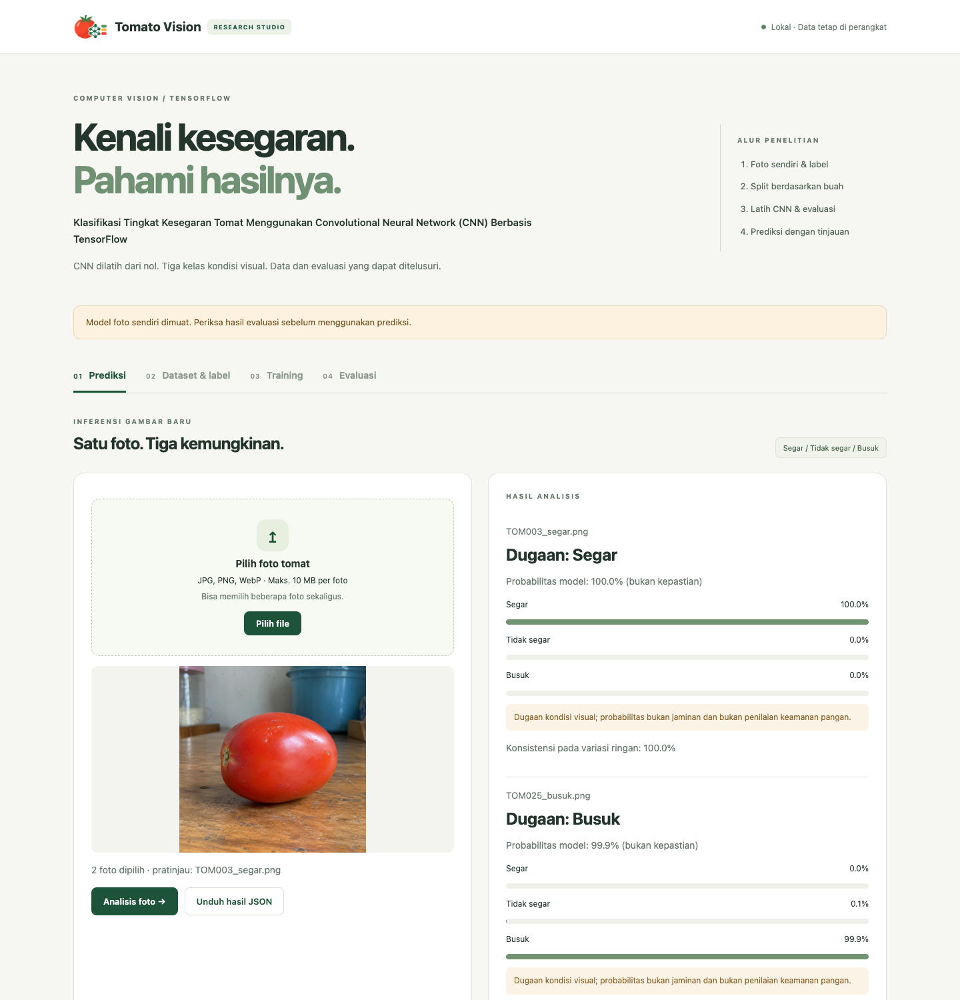
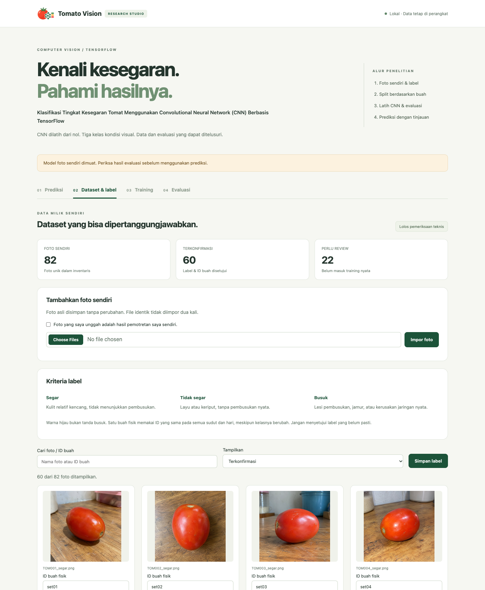
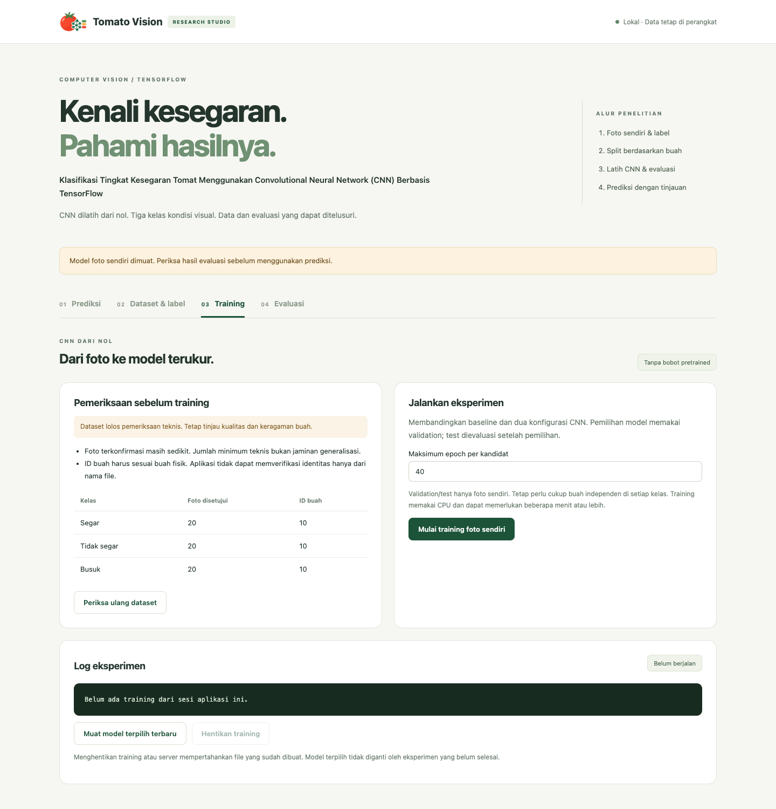
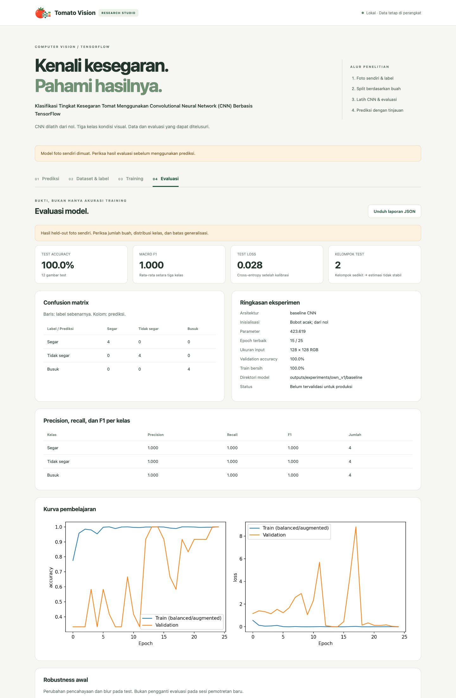

<p align="center"></p>

# Tomato Vision

**Klasifikasi Tingkat Kesegaran Tomat Menggunakan Convolutional Neural Network (CNN) Berbasis TensorFlow**

Klasifikasi **kondisi visual** tomat: `segar`, `tidak_segar`, `busuk`.
Dua CNN dibangun dari nol (tanpa transfer learning) dan dilatih dari foto sendiri.

## Status

Pipeline, pelabelan, training, evaluasi, dan demo prediksi tersedia. Dataset
berisi 82 foto unik; 60 foto sudah berlabel (20 per kelas, 10 kelompok per kelas)
dan 22 foto lain belum dilabeli. Dataset masih kecil, jadi angka evaluasi hanya
indikasi awal dan model belum boleh disebut siap produksi.
Lihat [panduan data](docs/DATASET.md), [panduan demo](docs/DEMO.md), dan
[penjelasan teknis proyek](docs/LAPORAN_PROYEK.md).

## Tampilan aplikasi

Aplikasi berjalan lokal di browser dan terdiri dari empat menu yang mengikuti alur kerja penelitian: prediksi, dataset, training, evaluasi.

### 1. Prediksi



Unggah satu atau beberapa foto tomat, lalu klik **Analisis foto**. Model menampilkan dugaan kelas (segar, tidak segar, atau busuk) beserta probabilitas ketiga kelas dalam bentuk bar. Setiap hasil juga memuat nilai konsistensi prediksi pada variasi ringan (flip dan perubahan cahaya), peringatan kualitas foto bila ada, dan penanda perlu tinjauan manual bila model ragu. Hasil bisa diunduh sebagai JSON. Foto yang dipakai untuk prediksi hanya diproses di memori dan tidak disimpan.

### 2. Dataset & label



Ringkasan jumlah foto (total, terkonfirmasi, dan yang perlu ditinjau), form untuk menambah foto sendiri, serta kriteria label. Setiap foto diberi kelas dan **ID buah fisik**, supaya semua foto dari buah yang sama selalu berada di split yang sama dan tidak terjadi kebocoran data. Tersedia pencarian dan filter (semua, belum dikonfirmasi, terkonfirmasi). Perubahan label dibackup otomatis dan edit dari tab yang usang ditolak.

### 3. Training



Sebelum training, aplikasi memeriksa kesiapan data: jumlah foto dan ID buah per kelas, serta peringatan bila data belum cukup. Tombol **Mulai training** menjalankan tiga kandidat CNN (baseline dan dua konfigurasi regularized) dari bobot acak. Log berjalan tampil di panel bawah dan training bisa dihentikan kapan saja tanpa menghapus hasil sebelumnya.

### 4. Evaluasi



Hasil model terpilih pada data test: accuracy, macro-F1, loss, confusion matrix, precision/recall/F1 per kelas, kurva pembelajaran, dan uji robustness (lebih gelap, lebih terang, blur). Data test pada contoh ini hanya 12 foto dari 2 kelompok buah, jadi angkanya mendekati sempurna tetapi **belum membuktikan** performa pada foto baru; aplikasi sendiri memberi peringatan itu di bagian atas halaman. Laporan lengkap bisa diunduh sebagai JSON.

## Setup bersih

Gunakan Python **3.11**, jalankan dari root proyek:

```bash
python3.11 -m venv .venv
source .venv/bin/activate
python -m pip install -r requirements.txt
python -m unittest discover -s tests -v
```

Windows: aktivasi dengan `.venv\Scripts\activate`. CPU didukung; GPU tidak wajib.
Untuk versi dependency transitif yang diuji pada macOS arm64, gunakan
`pip install -r requirements-lock-macos-arm64.txt` di environment kosong.
Seed 42 dan operasi deterministik diaktifkan. Hasil bit-per-bit lintas perangkat/
versi tidak dijamin. Run menyimpan versi runtime, konfigurasi, snapshot source, dan hash data.

## Demo dan pelabelan

```bash
python -m src.check --deep
python -m src.app
```

Buka **http://127.0.0.1:7860**. Aplikasi memiliki empat menu: **Prediksi**,
**Dataset & label**, **Training**, dan **Evaluasi**. Anotasi disimpan ke
`data/annotations.csv` dengan backup dan kontrol versi agar tab lama tidak menimpa
label baru. Foto untuk **prediksi** hanya diproses di memori; foto pada menu
**Impor foto** disimpan sebagai data setelah konfirmasi pengguna.
Gunakan `--labels-only` untuk pelabelan tanpa model, atau `--run direktori_run`
untuk memilih model. Hanya di-bind ke localhost; bukan server publik.

Sesudah training selesai, klik **Muat model terpilih terbaru**. Menutup server
membatalkan training yang dimulai sesi tersebut, tanpa menghapus file hasil.

Isi satu ID tetap per **buah fisik**, termasuk semua hari/sudutnya.
Jangan memberi ID baru hanya karena nama foto/hari berubah. Label yang belum pasti
jangan disetujui. Lihat kriteria kelas di panduan data.

## Training

Tambahkan foto JPG/JPEG/PNG/WebP ke `data/raw/`, lalu inventarisasi dan labeli:

```bash
python -m src.manifest --init-labels
python -m src.app --labels-only
```

Setelah label dan kelompok disetujui, jalankan:

```bash
python -m src.pipeline --output outputs/experiments/own_v1
```

Direktori output **harus baru**; model lama tidak ditimpa.
Pipeline menolak dataset tidak lengkap, kelas hilang, atau jumlah kelompok tidak
cukup. Batas teknis minimal tiga kelompok per kelas **bukan** kecukupan ilmiah.
Validation/test tidak diaugmentasi.

Perintah tersebut (juga dapat dijalankan lewat menu Training):

1. Memeriksa label, SHA-256, duplikat piksel, kemiripan dHash.
2. Membekukan split berbasis buah (target 70/15/15, dapat berbeda karena kelompok).
3. Melatih baseline dan dua konfigurasi CNN regularized dengan early stopping.
4. Memilih kandidat dengan validation macro-F1, tie-break validation loss.
5. Menguji baseline dan pemenang pada test yang sama setelah pemilihan selesai.
6. Menyimpan penunjuk model demo ke `outputs/selected_run.json`.

Jangan mengubah hyperparameter berdasarkan test. Untuk dataset berkembang, buat
versi baru dan dokumentasikan perubahan; jangan bandingkan angka lintas split
seolah eksperimennya setara.

## Inferensi CLI

```bash
python -m src.predict --image data/raw/TOM001_segar.png
```

Bisa memberi beberapa path setelah `--image`, `--run direktori_run`, dan
`--output outputs/prediksi.json`. Preprocessing sama dengan training:
orientasi EXIF → RGB → letterbox → float [0,1].
Satu tomat harus terlihat jelas. Model tidak mendeteksi non-tomat, banyak buah,
atau keamanan pangan. Probabilitas tinggi bukan bukti prediksi benar.
Hasil menyertakan probabilitas mentah, alasan tinjauan manual, kualitas gambar,
dan konsistensi prediksi pada empat variasi ringan.

## Training/evaluasi terpisah dan ekspor augmentasi

```bash
python -m src.train --dataset data/prepared/<fingerprint> --run outputs/experiments/single_baru --config configs/default.json
python -m src.evaluate --run outputs/experiments/single_baru
python -m src.export_augmentation --dataset data/prepared/<fingerprint> --output data/augmented/export_baru --per-class 1000
```

Bundle dibuat oleh `python -m src.manifest`. Ekspor hanya memakai sumber train.
Variasi hasil ekspor bukan foto independen; CSV menyimpan parent hash dan group ID.
Training default menggunakan augmentasi online, sehingga ekspor tidak perlu
diimpor kembali.

## Struktur

```text
configs/default.json             konfigurasi tervalidasi
data/reference_import/          foto ZIP, nama dipertahankan
data/raw/                       foto tambahan
data/annotations.csv            label dan ID buah manual
data/duplicates.csv             salinan identik yang dikecualikan
data/prepared/<fingerprint>/    manifest dan split terkunci
data/augmented/                 variasi TRAIN dengan parent provenance
src/manifest.py                 inventarisasi, QC, versi dataset
src/dataset_split.py            split kelompok dan guard leakage
src/preprocessing.py            loader bersama, sampling, augmentasi
src/model.py                    baseline dan residual separable CNN
src/train.py                    training reproducible
src/evaluate.py                 metrik, confusion matrix, robustness
src/experiment.py               tuning validation-only
src/cross_validate.py           studi development berkelompok, test terkunci
src/quality.py                  diagnostik kualitas dan ketidakpastian
src/pipeline.py                 orkestrasi end-to-end
src/predict.py                  inferensi CLI/library
src/workspace.py                impor, revisi anotasi, kesiapan dataset
src/jobs.py                     training lokal, log, pembatalan
src/check.py                    pemeriksaan model, environment, data
src/app.py + web/               aplikasi lokal empat menu
tests/                          tes otomatis
outputs/experiments/<run>/      model.keras, run.json, history, grafik,
                                snapshot source, dataset, evaluasi, prediksi
docs/                           dataset card, demo, penjelasan teknis
```

Model H5 dan dummy lama dipertahankan tetapi **tidak dipakai pipeline baru**.
`data/external/` juga tidak dipakai. Tidak ada download dataset publik atau bobot
pretrained dalam alur training.
