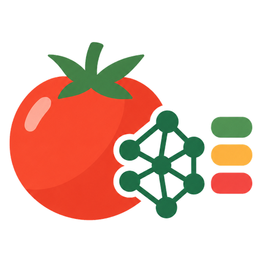
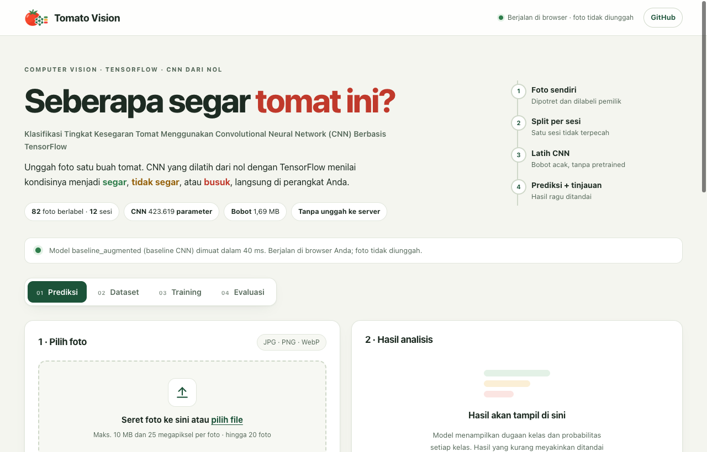
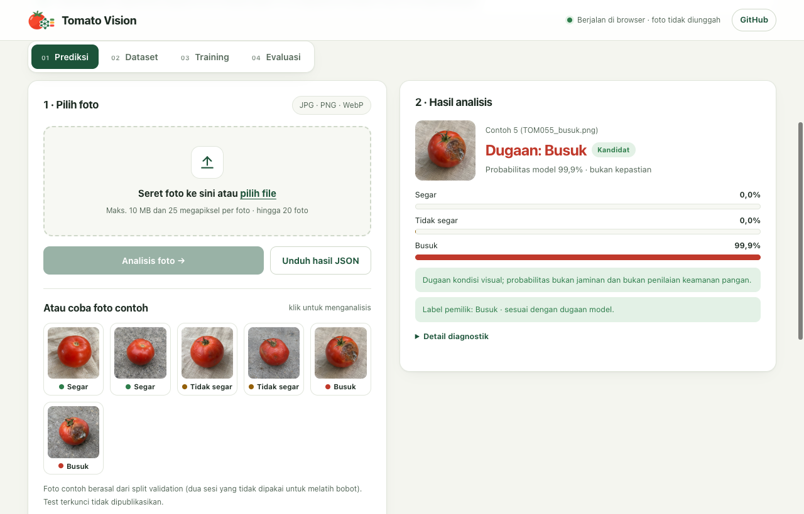
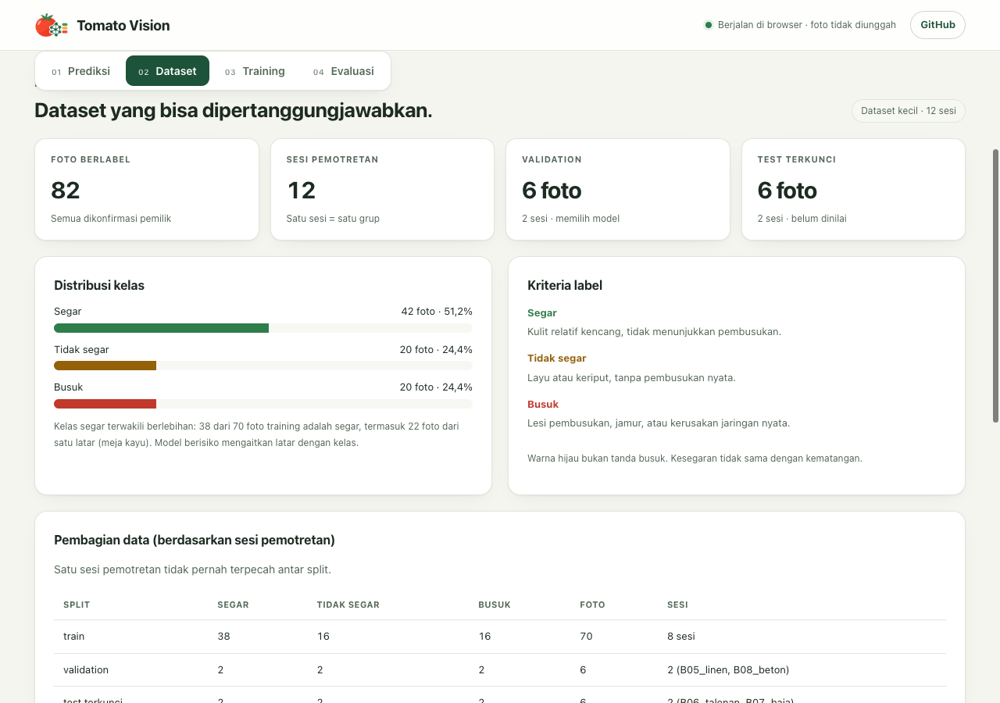
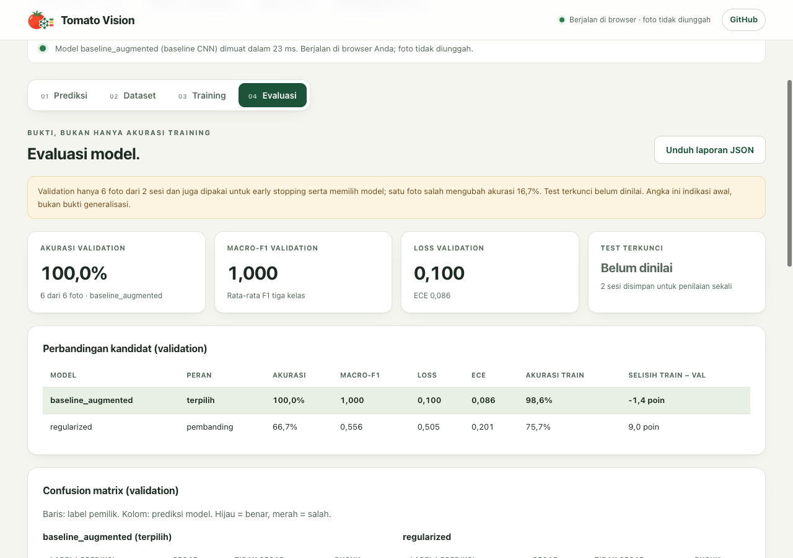
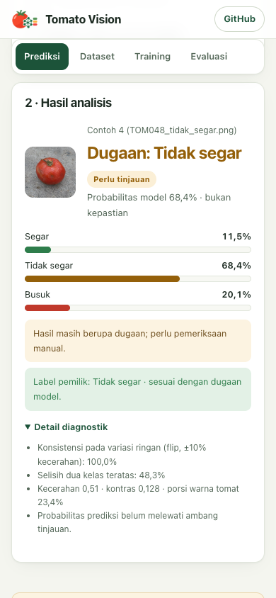

<p align="center"></p>

# Tomato Vision

[](https://colab.research.google.com/github/sellebeww/tomato-vision/blob/main/notebooks/tomato_vision_colab.ipynb)
[](https://github.com/sellebeww/tomato-vision/actions/workflows/pages.yml)


**Klasifikasi Tingkat Kesegaran Tomat Menggunakan Convolutional Neural Network (CNN) Berbasis TensorFlow**

**Demo online: https://sellebeww.github.io/tomato-vision/**

CNN dari nol (TensorFlow/Keras) yang menilai **kondisi visual** satu tomat: `segar`, `tidak_segar`, atau `busuk`. Keluarannya dugaan, probabilitas, dan penanda **perlu tinjauan**; bukan penilaian keamanan pangan.

## Sekilas

- **Dari nol:** CNN dilatih dengan TensorFlow/Keras tanpa bobot pretrained, dari 82 foto berlabel (dataset kecil).
- **Evaluasi jujur:** data dibagi per sesi pemotretan agar tidak bocor antar split, dan test terkunci belum dibuka.
- **Privat:** model berjalan di browser lewat JavaScript (GitHub Pages tidak bisa menjalankan Python), jadi foto tidak diunggah ke server mana pun. Versi TensorFlow asli: `python -m src.predict` atau notebook Colab.

| | |
|---|---|
|  |  |
| **Halaman utama.** Ringkasan proyek dan status model. | **Prediksi.** Pilih foto atau coba foto contoh; hasil berupa probabilitas per kelas. |
|  |  |
| **Dataset.** Distribusi kelas, pembagian per sesi, dan audit kebocoran data. | **Evaluasi.** Akurasi, confusion matrix, dan prediksi per foto, lengkap dengan batas klaimnya. |

<p align="center"><br><sub>Tampilan di ponsel.</sub></p>

> Hasil masih indikasi awal: validation hanya 6 foto dari 2 sesi, jadi angka tinggi belum membuktikan model akan akurat pada foto baru.

Isi: [Coba demo](#coba-demo) · [Cara kerja](#cara-kerja) · [Jalankan versi TensorFlow](#jalankan-versi-tensorflow) · [Hasil dan keterbatasan](#hasil-dan-keterbatasan) · [Struktur repo, tes, dan data](#struktur-repo-tes-dan-data)

## Coba demo

Buka halaman demo, pilih atau seret satu atau beberapa foto tomat (JPG, PNG, WebP; hingga 20 foto, maks. 10 MB per foto), lalu klik **Analisis foto**. Demo menampilkan:

- dugaan kelas dan probabilitas ketiga kelas,
- penanda **Perlu tinjauan** bila model ragu, hasil berubah pada variasi ringan, atau kualitas foto rendah,
- foto contoh dari split validation (test terkunci tidak dipublikasikan), serta tab dataset, training, dan evaluasi.

**Privasi:** foto diproses sepenuhnya di browser Anda dan tidak dikirim ke server mana pun. Halaman demo tidak memuat skrip atau font dari pihak ketiga; tautan ke README dan Colab hanya tautan biasa.
Kotak **Tentang demo ini** di halaman menjelaskan hal yang sama beserta angka paritasnya.

## Cara kerja

```text
foto sendiri + label
        │
        ▼
 training TensorFlow/Keras  ──►  model.keras  ──►  python -m src.predict   (TensorFlow asli: lokal / Colab)
 (CPU, seed tetap)                    │
                                      │ python -m src.export_web
                                      ▼
                        bobot float32 + graf (model.json, weights.bin)
                                      │
                                      ▼
                   inferensi JavaScript murni di browser (GitHub Pages)
```

GitHub Pages hanya menyajikan file statis dan tidak dapat menjalankan Python atau TensorFlow. Karena itu bobot model Keras diekspor (BatchNorm dilipat ke konvolusi), lalu dijalankan oleh `site/tomato-core.js` di browser. Kode JavaScript meniru preprocessing Python (orientasi EXIF → RGB → letterbox 128×128 → [0,1]), diagnostik kualitas foto, dan logika "perlu tinjauan".

Kesamaan hasil tidak diasumsikan, tetapi diuji. Angka berikut dihasilkan otomatis (`python -m src.export_web`, lalu `node tests/js_parity.mjs --write-info`) dan disalin ke sini oleh `python -m scripts.sync_docs`; jangan diedit tangan:

<!-- model_info:start -->
Diambil otomatis dari [`site/model_info.json`](site/model_info.json) (model `baseline_augmented`, diekspor 9 Oktober 2026):

- Model: CNN `baseline`, 423.619 parameter, bobot web 1,69 MB. Dilatih dengan TensorFlow 2.16.1 / Keras 3.15.1.
- Ekspor vs Keras: selisih maksimum probabilitas 6.7e-07 (gerbang ekspor: 1.0e-04).
- JavaScript vs Keras (13 kasus uji, `tests/js_parity.mjs`): selisih maksimum keluaran jaringan **8.3e-07** (batas uji 1.0e-04); termasuk pengubahan ukuran foto, selisih probabilitas maksimum **5.8e-07** (batas 1.0e-02).
<!-- model_info:end -->

Tes yang menjaga kesamaan ini:

| Tes | Yang dibandingkan |
|---|---|
| `python -m unittest tests.test_web_export` | graf yang diekspor vs keluaran Keras tersimpan |
| `node tests/js_parity.mjs` | JavaScript vs prediktor Python (tensor input per byte, jaringan, probabilitas, status tinjauan) |
| `python -m unittest tests.test_predict_vs_web` | `python -m src.predict` vs JavaScript pada foto contoh yang sama |
| `node tests/site_smoke.mjs`, `node tests/site_about_smoke.mjs` | situs di Chrome: model, unggah, layar ponsel, tanpa request eksternal |

## Jalankan versi TensorFlow

Tiga jalur, dari yang paling mudah. Semuanya CPU saja; GPU tidak diperlukan. Model yang dijalankan adalah model Keras yang sama dengan sumber bobot demo (`models/release/`, disalin oleh `python -m src.export_web`).

### 1. Colab (tanpa instalasi)

[](https://colab.research.google.com/github/sellebeww/tomato-vision/blob/main/notebooks/tomato_vision_colab.ipynb)

Notebook meng-clone repo, memasang dependensi, meminta unggahan foto, menjalankan prediksi, dan menampilkan probabilitas.

> **Belum diuji di Colab.** Isi notebook sudah dijalankan secara lokal (tanpa langkah clone, `pip install`, dan `files.upload` milik Colab). Semua versi di `requirements.txt` memiliki wheel Linux x86_64 untuk Python 3.11 dan 3.12 (dicek dengan `pip install --dry-run`), tetapi tidak untuk Python 3.13. Bila runtime Colab sudah 3.13, notebook memakai TensorFlow bawaan Colab dan menampilkan peringatan bahwa kombinasi itu belum diuji.

### 2. Lokal dengan `predict.py`

```bash
git clone https://github.com/sellebeww/tomato-vision.git
cd tomato-vision
python3.11 -m venv .venv
source .venv/bin/activate            # Windows: .venv\Scripts\activate
python -m pip install -r requirements.txt

python -m src.predict foto.jpg                  # satu foto
python -m src.predict a.jpg b.png folder_foto/  # banyak foto dan/atau folder (tidak rekursif)
python -m src.predict foto.jpg --json           # JSON lengkap; --output hasil.json untuk menyimpan
```

Contoh keluaran:

```text
foto.jpg
  Dugaan      : tidak_segar (83.6%) -> PERLU TINJAUAN
  Probabilitas: segar   0.0% | tidak_segar  83.6% | busuk  16.4%
  - Prediksi berubah pada flip atau perubahan pencahayaan ringan.
```

Preprocessing dan ambang "perlu tinjauan" identik dengan demo web. File yang bukan gambar menghasilkan pesan jelas (`GAGAL: Bukan file gambar yang dapat dibaca…`), foto lain tetap diproses, dan kode keluar bernilai 1. Python **3.11** (diuji: 3.11.9); versi lain belum diuji. Versi paket dipin di [requirements.txt](requirements.txt); untuk versi transitif yang diuji di macOS arm64 ada `requirements-lock-macos-arm64.txt`.

### 3. Reproduksi training

Foto asli **tidak ikut repo** (`data/raw/` dan label pribadi ada di `.gitignore`). Hanya 6 foto validation yang diterbitkan sebagai contoh (`site/examples/`, tanpa metadata EXIF); foto test terkunci tidak diterbitkan. Untuk mengulang training Anda perlu foto sendiri:

```bash
# letakkan foto JPG/PNG/WebP di data/raw/, lalu beri label dan ID buah
python -m src.manifest --init-labels
python -m src.app --labels-only            # aplikasi pelabelan lokal, http://127.0.0.1:7860

# training satu kali (seed 42, direktori output harus baru; model lama tidak ditimpa)
python -m src.pipeline --output outputs/experiments/saya_v1
python -m src.predict foto.jpg --run outputs/experiments/saya_v1/baseline
```

Seed 42 dan operasi deterministik diaktifkan, tetapi hasil bit-per-bit lintas perangkat atau versi TensorFlow tidak dijamin. Setiap run menyimpan versi runtime, konfigurasi, snapshot source, dan hash data. Validation/test tidak diaugmentasi dan hyperparameter tidak boleh diubah berdasarkan test.

**Ekspansi dataset lokal (7 Oktober 2026):** tersedia 360 variasi training baru,
120 per kelas, di `data/augmented/own_v3_360/`. CSV gabungannya memuat 420 gambar
(60 foto asli + 360 augmentasi). Pipeline umum kini menjaga grup sesi dan enam
foto test terkunci. Variasi bukan buah baru atau bukti peningkatan akurasi;
lihat [dataset card dan perintah reproduksi](docs/DATASET.md#ekspansi-dataset-7-oktober-2026).

**Penggabungan foto primer (9 Oktober 2026):** 22 foto di `data/reference_import/` digabung sebagai `segar`; manifest baru `data/prepared/ff822adef8db3ae5` (82 foto: 70 train / 6 val / 6 test terkunci). Dilatih ulang di `outputs/experiments/own_v4_ref22/`; validation hanya enam foto, jadi hasilnya bukan bukti peningkatan. Sejak 9 Oktober 2026 demo web menjalankan kandidat terpilih `baseline_augmented` (dengan `regularized` sebagai pembanding), diekspor dengan `python -m src.export_web --study own_v4_ref22`; test terkunci tetap belum dinilai. Lihat [catatan dataset](docs/DATASET.md#penggabungan-foto-primer-9-oktober-2026).

Studi evaluasi `own_v2` (validasi silang 5 fold berbasis sesi × 5 seed, protokol dibekukan sebelum training) dijalankan oleh satu perintah yang bisa dilanjutkan bila terputus:

```bash
nohup caffeinate -i bash scripts/run_own_v2.sh > outputs/experiments/own_v2/driver.log 2>&1 &
```

Skrip ini menjalankan sweep (`python -m src.cv_study sweep`), lalu `scripts/finish_own_v2.py`: summarize → select (aturan yang sudah dideklarasikan) → refit final → test terkunci **satu kali** → ekspor demo → paritas JS → README dan draf laporan → semua tes. Hasilnya dicatat di `outputs/experiments/own_v2/release_status.md`. Satu run butuh puluhan menit di CPU, jadi studi lengkap berjalan sekitar satu hari. Setiap langkah menolak menimpa artefak sebelumnya. Rincian per langkah ada di docstring [src/cv_study.py](src/cv_study.py).

## Hasil dan keterbatasan

<!-- results:start -->
Diambil otomatis dari [`site/data/report.json`](site/data/report.json) (studi `own_v4_ref22`, model demo web). Data: 82 foto berlabel dari 12 sesi; satu split tetap berbasis sesi: 70 train, 6 validation (sesi B05_linen, B08_beton), 6 test terkunci (sesi B06_talenan, B07_baja, belum dinilai).

| Kandidat | Parameter | Akurasi train | Akurasi validation | Macro-F1 validation | Loss validation |
|---|---|---|---|---|---|
| **baseline_augmented** (terpilih) | 423.619 | 98,6% | 100,0% (6/6) | 1,000 | 0,100 |
| regularized | 96.019 | 75,7% | 66,7% (4/6) | 0,556 | 0,505 |

Aturan seleksi: macro-F1 validation tertinggi, lalu loss validation terendah. Validation juga dipakai untuk early stopping, jadi skornya optimistis; dengan hanya 6 foto, satu foto salah mengubah akurasi 16,7%. Angka ini indikasi awal, bukan bukti generalisasi.
<!-- results:end -->

Keterbatasan yang harus dibaca sebelum memercayai angka apa pun:

- **Data training sangat kecil:** 82 foto asli berlabel dari 12 grup sesi: 60 foto lama (20 per kelas) dan 22 foto primer impor berlabel `segar` oleh pemilik (9 Oktober 2026; satu latar, satu grup, kondisi tidak diperiksa per foto), sehingga kelas segar berlebih. Asal pengambilan sumber lama perlu bukti terpisah. Foto dalam satu sesi bukan sampel independen.
- **Kebocoran sesi sudah ditemukan:** audit versi pertama (`own_v1`, split per "set") menunjukkan sesi `A_meja_kayu` (30 foto, kemungkinan satu buah yang sama) tersebar di train, validasi, dan test (18, 6, dan 6 foto). Karena itu akurasi 100% pada `own_v1` **tidak boleh dipakai sebagai bukti kinerja**. Studi `own_v2` memakai sesi sebagai grup sehingga satu sesi tidak pernah terpecah antar split.
- **Test terkunci sangat kecil:** 6 foto (2 per kelas) dari 2 sesi (`B06_talenan`, `B07_baja`, dibekukan di `protocol.json`), jadi interval kepercayaannya sangat lebar; satu foto salah mengubah akurasi test sekitar 17 poin persen.
- **Mudah gagal di luar kondisi data:** pencahayaan, latar, kamera, atau varietas yang berbeda dapat menurunkan akurasi. Uji robustness awal menunjukkan kinerja turun pada foto buram.
- **Bukan detektor tomat:** model tidak mengenali non-tomat atau banyak buah. Pemeriksaan warna hanya menandai gambar yang hampir tanpa warna tomat; objek merah lain tetap bisa diberi probabilitas tinggi.
- **Bukan jaminan keamanan pangan** dan belum siap produksi (`production_ready: false`). Probabilitas tinggi bukan bukti prediksi benar.

## Struktur repo, tes, dan data

```text
src/             pipeline: manifest, split sesi, model, train, evaluate, cv_study, predict, export_web, app lokal
site/            demo statis GitHub Pages (index.html, app.js, tomato-core.js, worker.js, model_info.json, data/)
models/release/  model Keras yang sama dengan bobot demo (dibuat oleh src.export_web)
notebooks/       tomato_vision_colab.ipynb
scripts/         run_own_v2.sh + finish_own_v2.py (studi → rilis), sync_docs.py (README/laporan dari JSON), strip_examples.py
tests/           tes Python (unittest), js_parity.mjs, js_predict.mjs, site_smoke.mjs, site_about_smoke.mjs
configs/ docs/   konfigurasi; dataset card, panduan demo, penjelasan teknis
submission/      laporan (.docx) dan paket dataset
.github/         workflow deploy Pages (menjalankan tes paritas dulu)
```

**Menjalankan tes** (dari root repo, venv aktif):

```bash
python -m unittest discover -s tests -v                # unit, ekspor web, predict.py, predict vs web
node tests/js_parity.mjs                               # paritas JavaScript vs Keras
python3 -m http.server 8765 -d site &                  # untuk tes browser
chrome --headless=new --remote-debugging-port=9235 about:blank &   # sesuaikan nama/jalur Chrome
node tests/site_smoke.mjs && node tests/site_about_smoke.mjs
python -m scripts.sync_docs --check                    # README sesuai site/model_info.json
```

Mengekspor ulang demo setelah model baru: `python -m src.export_web`, lalu `node tests/js_parity.mjs --write-info`, lalu `python -m scripts.sync_docs`. Untuk mengaktifkan GitHub Pages: push ke `main`, lalu **Settings → Pages → Source: GitHub Actions**.

**Aplikasi lokal** (pelabelan, training, evaluasi; bind hanya ke localhost): `python -m src.check --deep && python -m src.app`. Panduannya ada di [docs/DEMO.md](docs/DEMO.md), kriteria label di [docs/DATASET.md](docs/DATASET.md), dan penjelasan teknis di [docs/LAPORAN_PROYEK.md](docs/LAPORAN_PROYEK.md).

**Lisensi dan data:** repo ini belum memiliki berkas lisensi, jadi hak penggunaan belum diberikan secara eksplisit. Foto tomat adalah milik pemilik repo dan tidak dipublikasikan penuh; foto contoh di demo diterbitkan tanpa metadata. Model dilatih dari bobot acak, tanpa dataset publik atau bobot pretrained.

## Berkas pengumpulan IS794

[Laporan Word](submission/IS794_Laporan_TomatoVision.docx),
[PPT final](submission/presentasi/IS794_Presentasi_Final.pptx),
[PPT Week 7](submission/presentasi/IS794_Presentasi_Week7.pptx), dan
[notebook proyek lengkap](notebooks/IS794_TomatoVision_Project.ipynb) tersedia.
Laporan memakai hasil validation own_v3 yang sudah diaudit, bukan hasil historis
own_v1. Notebook mencakup EDA, CNN, training opsional, evaluasi ulang, dan inferensi.

Lihat [audit ketentuan](submission/audit/KESESUAIAN_IS794.md) dan
[pembeda penelitian](submission/audit/PEMBEDA_DAN_PRESENTASI.md).
Jumlah file dataset tidak otomatis membuktikan minimal 100 data primer.
Format laporan dibuat DOCX sesuai permintaan; PDF tetap diminta dalam ketentuan
pengumpulan resmi. Identitas dan kontribusi digabungkan dari dokumen tim.

```bash
python -m pip install -r requirements-submission.txt
python -m src.selective_evaluation --run outputs/experiments/own_v3_augmented/regularized --output outputs/selective_review_baru.json
python -m scripts.build_assignment_submission
python -m scripts.validate_submission
```
